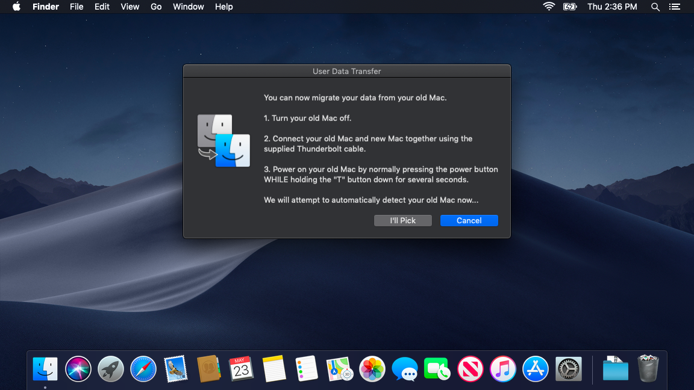

# Thunderbolt Data Migration
A script that automates data transfer from one mac to another easily. This is intended to be used by non-technical individuals with minimal hassle on Macs managed by Jamf Pro (could be customized for other environments).
<p align="center">
    
</p>

## Requirements
- jamfHelper is used to display some of the the user dialogs while the script is running.

*Note: There are no Jamf Pro policies required in order for this tool to function. You could easily adapt this for use in other environments using a tool like [cocoadialog](https://cocoadialog.com/).*

## Usage
This script needs to be run in a BASH shell. You can do the following:
```bash
# Cloning the repo is preferred
git clone https://github.com/ryangball/thunderbolt-data-migration.git
cd thunderbolt-data-migration
sudo ./thunderbolt_data_migration.sh
```

*OR*

```bash
# If you chose to just copy the raw script text
cd /path/where/you/copied/the/script/
chmod +x thunderbolt_data_migration.sh
sudo ./thunderbolt_data_migration.sh
```

*OR*

```bash
# If you chose to just copy the raw script text
cd /path/where/you/copied/the/script/
sudo bash thunderbolt_data_migration.sh
```

## Testing
By default the script is set to not perform the rsync action when `testing="true"`.
```bash
# Set to true while testing, the rsync will be bypassed and nothing permanent will done to this Mac
# Set to false when used in production
testing="true"  # (true|false)
```

## Workflow
1. User receives a dialog box with simple instructions to start up their old machine in [Target Disk Mode](https://support.apple.com/en-us/HT201462) and connect it to their new Mac via Thunderbolt cable (top-most image)
2. If a user successfully connects their Target Disk Mode booted Mac, the Thunderbolt volume will be detected automatically and move on.
3. In the event that a Target Disk Mode booted Mac is already connected before the script begins, the user has an option to select the Thunderbolt volume themselves.
4. If a user exists on the old Mac that matches the logged in username on the new Mac, the script will automatically assume that old user's home folder is the source of our transfer.
5. If **no** user exists on the old Mac that matches the logged in username on the new Mac, the user will get an option to select from a list of user home folders to determine the source of our transfer.
6. The script then determines if there is enough space to transfer from the source home folder to the new Mac and continues if space requirements are met.
7. A full screen jamfHelper dialog is then displayed while the old home folder data is transferred to the logged in user's home folder on the new Mac (using [rsync](https://ss64.com/osx/rsync.html)) (image below).
<p align="center">
    
</p>